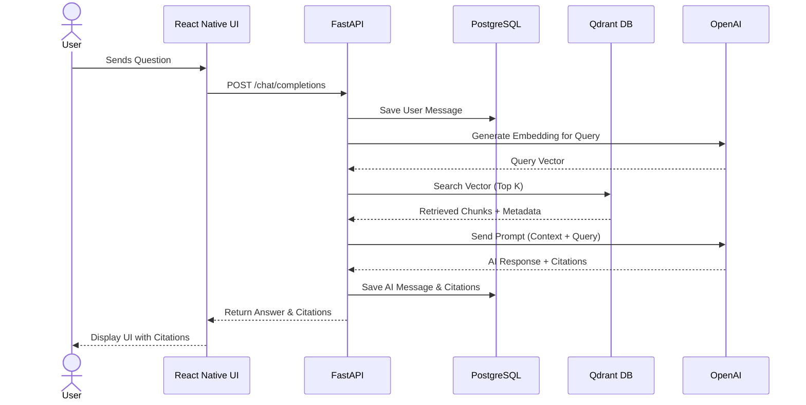
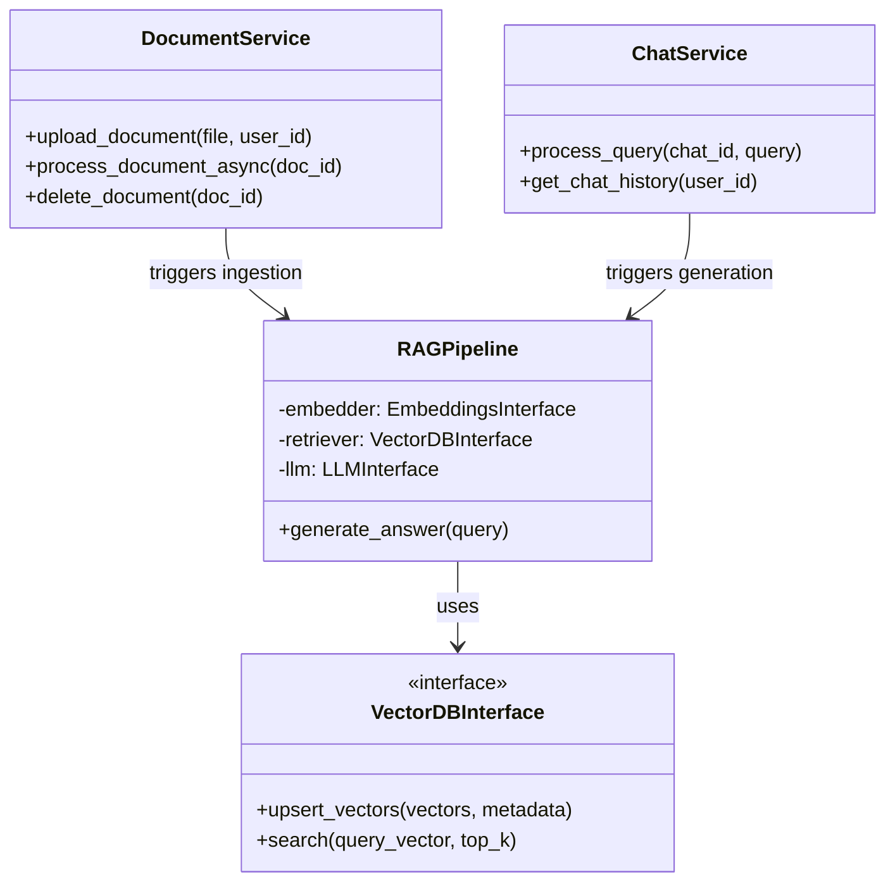

# Enterprise Knowledge AI Assistant - Software Design Document (SDD)

## 1. Project Overview
The Enterprise Knowledge AI Assistant is a production-grade internal knowledge retrieval platform. It empowers employees to upload, index, and query internal company documents (e.g., HR policies, SOPs, compliance manuals, technical documentation) using natural language. The system leverages Retrieval-Augmented Generation (RAG) to provide highly accurate, hallucination-free answers, grounded by concrete document citations. 

## 2. Problem Statement
Modern enterprises struggle with fragmented knowledge silos. Employees waste countless hours searching for information across disjointed PDF, DOCX, and TXT files, often relying on outdated documents. Traditional keyword search is inefficient and lacks contextual understanding, leading to reduced productivity and potential compliance risks.

## 3. Goals
- **Accuracy & Trust:** Deliver precise answers exclusively sourced from uploaded documents.
- **Traceability:** Provide exact citations (document name, page number, context) for every AI response.
- **Scalability:** Build a robust, scalable backend that can handle thousands of enterprise documents and concurrent user queries.
- **Modularity:** Ensure LLM and vector database components are abstracted and swappable.
- **User Experience:** Provide a modern, intuitive, and responsive mobile-first SaaS interface.

## 4. Functional Requirements
- **Authentication:** JWT-based user registration, login, and secure session management.
- **Document Management:** Upload, delete, replace, and search PDF, DOCX, and TXT documents.
- **AI Chat Interface:** Natural language querying with streaming (optional) responses and conversation history.
- **Citation System:** AI responses must strictly map to retrieved chunks, displaying document names, pages, and confidence metrics.
- **AI Summaries & Suggestions:** Provide document summaries and auto-generated suggested questions.

## 5. Non-functional Requirements
- **Scalability:** Stateless backend architecture for easy horizontal scaling.
- **Performance:** Low-latency vector retrieval (< 100ms) and optimized LLM generation times.
- **Security:** Data encryption at rest and in transit. Strict tenant or role-based access control (future-proofing).
- **Maintainability:** Adherence to SOLID principles, clean architecture, and comprehensive documentation.
- **Reliability:** Graceful error handling and fallback mechanisms if an LLM provider goes down.

## 6. Technology Justification
- **Backend - FastAPI:** Provides high-performance async capabilities, automatic OpenAPI validation, and fast development cycles—ideal for AI/I/O-bound applications.
- **Frontend - React Native (Expo):** Enables cross-platform (iOS, Android, Web) development with a single codebase. NativeWind allows for rapid, consistent styling.
- **Database - PostgreSQL:** ACID-compliant, enterprise-proven relational database for robust metadata and user management.
- **Vector DB - Qdrant:** Highly scalable, fast, open-source vector search engine with excellent filtering capabilities for metadata-rich RAG.
- **Orchestration - LangChain:** Speeds up prompt chaining and chunking logic, but wrapped in an abstraction layer to prevent vendor lock-in.
- **LLM / Embeddings - OpenAI/OpenRouter:** State-of-the-art reasoning and embedding models (`text-embedding-3-small` is fast and cost-effective). OpenRouter provides fallback models.

## 7. High-Level Architecture
The system follows a classic decoupled Client-Server architecture with a specialized AI service layer:
- **Presentation Layer:** React Native Expo app (UI/UX).
- **API Gateway / Application Layer:** FastAPI handles routing, auth, validation, and orchestrates services.
- **Data Persistence Layer:** PostgreSQL for structured relational data. Qdrant for high-dimensional vector data.
- **External AI Providers:** OpenAI / OpenRouter for LLM and Embedding endpoints.

## 8. Low-Level Architecture
Following Clean Architecture principles:
- **Routers (`api/`):** API endpoints and HTTP request/response validation (Pydantic).
- **Services (`services/`):** Core business logic (e.g., `DocumentService`, `ChatService`, `AuthService`).
- **RAG Engine (`rag/`):** Contains `IngestionPipeline`, `Retriever`, and `Generator` classes. Abstracted via interfaces.
- **Data Access (`database/`):** Repository pattern for PostgreSQL queries using SQLAlchemy.

## 9. Database Design

### PostgreSQL (Relational)
- **Users:** `id`, `email`, `hashed_password`, `created_at`, `updated_at`
- **Documents:** `id`, `user_id` (uploader), `filename`, `file_type`, `status` (processing, ready, failed), `uploaded_at`
- **DocumentChunks (Optional SQL mirror):** `id`, `document_id`, `page_number`, `chunk_text`, `chunk_index`
- **Chats:** `id`, `user_id`, `title`, `created_at`, `updated_at`
- **Messages:** `id`, `chat_id`, `role` (user/ai), `content`, `created_at`
- **Citations:** `id`, `message_id`, `document_id`, `page_number`, `score`

### Qdrant (Vector)
- **Collection:** `enterprise_knowledge`
- **Vectors:** `text-embedding-3-small` (1536 dimensions)
- **Payload/Metadata:** `document_id`, `chunk_id`, `page_number`, `text_content`, `filename`

## 10. API Design

**Authentication**
- `POST /api/v1/auth/register`
- `POST /api/v1/auth/login`

**Documents**
- `POST /api/v1/documents/upload` (Multipart form-data)
- `GET /api/v1/documents`
- `GET /api/v1/documents/{id}`
- `DELETE /api/v1/documents/{id}`

**Chat**
- `POST /api/v1/chat/completions` (Send message, get AI response)
- `GET /api/v1/chat/history` (List chat sessions)
- `GET /api/v1/chat/{chat_id}/messages` (Get messages for a session)

**Users**
- `GET /api/v1/users/me`

## 11. Folder Structure

```text
enterprise-ai/
├── frontend/                 # React Native Expo
│   ├── app/                  # Expo Router pages
│   ├── components/           # Reusable UI components
│   ├── hooks/                # Custom React hooks (TanStack Query)
│   ├── store/                # Redux Toolkit setup
│   ├── services/             # Axios API calls
│   └── utils/                # Helper functions
└── backend/                  # FastAPI
    ├── app/
    │   ├── api/              # Routers (auth.py, documents.py, chat.py)
    │   ├── core/             # Config, security, exceptions
    │   ├── database/         # Postgres session, models (SQLAlchemy)
    │   ├── schemas/          # Pydantic models (requests/responses)
    │   ├── services/         # Business logic
    │   ├── rag/              # RAG specific logic
    │   │   ├── document_parser.py
    │   │   ├── chunker.py
    │   │   ├── embeddings.py
    │   │   └── generator.py
    │   └── vector_db/        # Qdrant client & interfaces
    ├── alembic/              # DB migrations
    ├── tests/                # Pytest cases
    └── requirements.txt
```

## 12. Data Flow
**Document Upload Flow:**
1. User uploads PDF via React Native app.
2. FastAPI `/upload` endpoint receives the file and saves it to a secure temp location/S3.
3. `DocumentService` creates a DB record with status "processing".
4. Background Task: `document_parser` extracts text -> `chunker` splits text -> `embeddings` generates vectors -> Qdrant stores vectors + metadata.
5. DB record status updated to "ready".

**Query Flow:**
1. User sends a query to `/chat`.
2. `ChatService` saves user message to Postgres.
3. `embeddings` generates vector for the query.
4. `vector_db` queries Qdrant for top-K closest chunks.
5. `generator` formats the prompt combining context chunks and user query.
6. LLM returns answer.
7. `ChatService` saves AI message and Citations to Postgres.
8. API returns answer and citations to the frontend.

## 13. RAG Pipeline
1. **Extraction:** PyMuPDF (fitz) or pdfplumber for PDFs, `python-docx` for DOCX.
2. **Chunking:** Semantic or Recursive Character Text Splitter (~500-1000 tokens per chunk with 10% overlap).
3. **Retrieval:** Vector search with MMR (Maximal Marginal Relevance) to ensure context diversity.
4. **Prompting:** Strict system prompt:
   *"You are an enterprise AI assistant. Answer the user's question using ONLY the provided context. If the answer is not contained in the context, reply 'I could not find information in the uploaded documents.' Cite your sources."*

## 14. Sequence Diagrams



## 15. Class Diagrams (Backend Core)



## 16. Deployment Architecture
- **Containerization:** Docker & Docker Compose for local dev.
- **Backend/API:** Deployed to AWS ECS / Render / Google Cloud Run.
- **Database (PostgreSQL):** Amazon RDS or Supabase.
- **Vector DB (Qdrant):** Qdrant Cloud or self-hosted Docker container.
- **Frontend:** Expo EAS Build, distributed via TestFlight / Google Play Console or web hosting (Vercel).

## 17. Security Considerations
- **Data Isolation:** Implement Row-Level Security (RLS) or strictly filter by `user_id` / `tenant_id` on both Postgres and Qdrant queries.
- **Rate Limiting:** Protect APIs against abuse using `slowapi`.
- **Secrets Management:** Use `.env` files locally; AWS Secrets Manager / environment variables in production.
- **Sanitization:** Sanitize all text before passing it to LLM to prevent prompt injection.

## 18. Error Handling Strategy
- **Global Exception Handlers:** FastAPI custom exception handlers to return consistent JSON error formats.
- **Retries:** Exponential backoff for external API calls (OpenAI, Qdrant) using `tenacity`.
- **Degradation:** If vector search fails, return a graceful "Context retrieval unavailable" rather than a raw 500 error.

## 19. Logging Strategy
- **Structured Logging:** Use `loguru` or Python's `logging` module outputting JSON.
- **Tracing:** Attach `correlation_id` to requests to trace logs across services.
- **Audit Trails:** Log document uploads, deletions, and potentially flagged queries for compliance.

## 20. Future Enhancements
- **Agentic Capabilities:** Allow the AI to query SQL databases or external APIs (e.g., Jira, Slack).
- **Hybrid Search:** Combine keyword search (BM25) with vector search for better retrieval accuracy.
- **Advanced RAG:** Implement Parent-Child chunking, Query Re-writing, or Re-ranking (Cohere).
- **RBAC:** Role-based access control for department-specific document visibility.

## 21. Development Roadmap & 22. Estimated Implementation Order

- **Phase 1:** System Architecture (Current Phase) - *Status: Completed*
- **Phase 2:** Backend Setup, Authentication & Database (FastAPI, Alembic, JWT, Users)
- **Phase 3:** Document Processing & Qdrant Integration (Uploads, Text Extraction, Chunking)
- **Phase 4:** Embeddings & Retrieval Pipeline (OpenAI Embeddings, Qdrant Search logic)
- **Phase 5:** LLM Integration & Chat API (Prompt Engineering, Chat endpoints, Citations)
- **Phase 6:** Frontend Development (React Native UI, API Hooks, Auth Flow, Chat UI)
- **Phase 7:** Polish & Containerization (Testing, Docker Compose, Deployment Prep)
